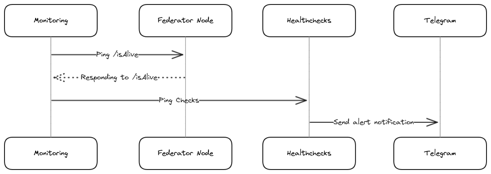

# Monitoreo de Disponibilidad y Sistema de Alertas Básico para el Nodo Federador
**Estado:** aceptado  
**Fecha:** 28-06-2024  
**Historia Técnica:** 

# [título breve del problema resuelto y solución]

* Estado: aceptado <!-- [propuesto | rechazado | aceptado | en desuso | … | reemplazado por [ADR-0005](0005-example.md)] -->
* Fecha: 2024-06-28  <!-- [AAAA-MM-DD cuando se actualizó la decisión por última vez]  -->

Historia técnica: Implementación de un sistema básico que permita monitorear la disponibilidad del nodo y  notificar en caso inactividad.  <!--[descripción | URL del ticket/emisión] < opcional -->

## Contexto y planteamiento del problema

Actualmente, no existe un sistema de monitoreo para verificar la disponibilidad del nodo, y los incidentes solo se identifican de manera reactiva. Esta falta de monitoreo proactivo resulta en respuestas tardías, impactando la calidad y fiabilidad del servicio proporcionado. ¿Cómo se puede implementar un sistema de bajo costo y eficiente para monitorear la disponibilidad del nodo y alertar a los interesados de manera oportuna cuando surjan incidentes?

<!-- [Describa el contexto y el planteamiento del problema, por ejemplo, en forma libre utilizando dos o tres oraciones. Es posible que desee articular el problema en forma de pregunta.] -->

### Detalles Técnicos

El nodo está implementado en `Node.js` y usa `RPC`. El core está implementado en TypeScript. La comunicación con la blockchain se realiza a través de JSON-RPC. La aplicación está containerizada usando Docker y utiliza docker-compose para integrarla con una base de datos, proporcionando un entorno aislado para el despliegue. Además, incluye endpoints para varias funcionalidades, como *verificar el estado del nodo* según se detalla a continuación.

* **<DOMAIN:PORT>/isAlive**
* **Method:**
  `GET`
* **Success Response:**
  * **Code:** 200  
    **Content:** `{ "status" : "ok" }`

Este endpoint de estado se utilizará para implementar el sistema de healthcheck. La herramienta de monitoreo consultará periódicamente este endpoint para asegurar que el nodo esté disponible.

## Impulsores de decisión <!-- opcional -->

<!-- * [conductor 1, por ejemplo, una fuerza, frente a una preocupación,…] -->

* La necesidad de implementar una solución de monitoreo de bajo costo debido al estatus no prioritario del proyecto y el presupuesto limitado disponible.
* Priorizar el costo sobre calidad de monitoreo.
* La falta actual de experiencia técnica con AWS requiere una solución sencilla y fácil de gestionar.

## Opciones consideradas

* [AWS CloudWatch](https://aws.amazon.com/cloudwatch/) 
* [Prometheus](https://prometheus.io/)
* [Healthchecks](https://healthchecks.io/)
 <!-- el número de opciones puede variar -->

## Resultado de la decisión

Opción elegida: [Healthchecks](https://healthchecks.io/), porque es la solución más barata y efectiva, se alinea con nuestro presupuesto limitado y es fácil de configurar y mantener. Cumple con nuestros impulsores de decisión al priorizar el costo sobre la calidad de monitoreo y no requiere experiencia técnica avanzada.

Los costos continuos para servicios en la nube/terceros son mínimos. [Healthchecks](https://healthchecks.io/), ofrece un plan para hobbiest a $0 por mes, que se ajusta a nuestras necesidades. AWS CloudWatch, puede requerir métricas personalizadas, con un costo potencial menor de USD 4 por mes. Prometheus no incurre en costos directos si se implementa en la instancia actual de EC2. El gasto principal es el desarrollo: Healthchecks.io es la opción más economica debido a los mínimos requisitos de recursos humanos y la experiencia existente. AWS sigue, con costos más altos debido a la inexperiencia, y Prometheus requiere el mayor esfuerzo de desarrollo debido a su naturaleza de código abierto y necesidad de adaptación.

<!-- Opción elegida: "[opción 1]", porque [justificación. por ejemplo, única opción que cumple con k.o. criterio de decisión conductor | que resuelve fuerza fuerza | … | sale mejor (ver más abajo)]. -->

### Consecuencias positivas <!-- opcional -->

<!-- * [por ejemplo, mejora de la satisfacción de los atributos de calidad, decisiones de seguimiento requeridas,…] -->
* Opción mas economica, lo que lo hace adecuado para nuestro estado de proyecto no prioritario y presupuesto limitado.
* Configuración minima, lo que nos permite implementar monitoreo sin profundos conocimientos técnicos.
* Reducción de la carga de mantenimiento al ser un servicio gestionado.
* Alertas y monitoreo confiables con planes de precios gratuitos y asequibles, asegurando notificaciones oportunas de incidentes.

### Consecuencias negativas <!-- opcional -->

* Flexibilidad limitada y menos características avanzadas en comparación con AWS CloudWatch y Prometheus, lo cual podría restringir la escalabilidad futura.
* Dependencia de un servicio de terceros para el monitoreo, lo que podría introducir riesgos de confiablidad si el servicio experimenta tiempo de inactividad.
* Menor control sobre la configuración avanzada y el manejo de datos, lo que podría limitar la personalización e integración con otros sistemas.

<!-- * [por ejemplo, comprometer el atributo de calidad, se requieren decisiones de seguimiento,…] -->

### Diseño Propuesto
<!-- sin entrar en la implementación siempre que sea posible -->

Un contenedor Docker aloja un script de monitoreo que verifica periódicamente el endpoint /isAlive del nodo. Este script envía pings al Check Point de Healthchecks si el servicio esta disponible. A su vez, Healthchecks notifica a través de Telegram si detecta que el nodo no está disponible.

Detalles:

* _Infraestructura como Código (IaC)_: Utilizar la [API de Healthchecks](https://healthchecks.io/docs/api/) para configurar y gestionar el chequeo de salud de manera programática, especificando el intervalo de verificación y configurando reglas de alerta.

* _Containerización con Docker_: El script de healthcheck y su correspondiente cron job se containerizarán usando Docker.

* _Integración con Docker Compose_: Integrar el contenedor de monitoreo con el archivo docker-compose.yml existente para asegurar que se ejecute junto con el servicio del nodo.

* _Integración con Telegram_: Configurar alertas para que notifique los incidentes través de la [integración de Telegram de Healthchecks.io](https://healthchecks.io/integrations/telegram/).

## Pros y contras de las opciones <!-- opcional -->

<!-- ### [Opción 1] -->

<!-- [ejemplo | descripción | puntero a más información | …] 

* Bien, porque [argumento a]
* Bien, porque [argumento b]
* Malo, porque [argumento c] -->

### AWS CloudWatch

[AWS CloudWatch](https://aws.amazon.com/cloudwatch/) es un servicio de monitoreo y gestión de AWS que proporciona información para monitorear aplicaciones y responder a cambios de rendimiento. Es un servicio de pago por uso (pay-as-you-go). La implementación requiere configurar CloudWatch para monitorear el endpoint `/isAlive`, creando funciones Lambda para healthcheck y configurar SNS para las alertas.

* Bueno, porque ofrece una buena integración con otros servicios de AWS.
* Bueno, porque proporciona capacidades robustas de alerta y monitoreo.
* Malo, porque puede ser costoso dependiendo del uso.
* Malo, porque requiere conocimiento de AWS, que actualmente no tiene nuestro equipo.
* Malo, porque la configuración inicial puede ser compleja debido a la integración de múltiples servicios de AWS (CloudWatch, Lambda, SNS).

### Prometheus

[Prometheus](https://prometheus.io/) es una herramienta de monitoreo y alerta de código abierto diseñada para ser confiable y escalabe. Recopila y almacena métricas como datos de series temporales, proporcionando un potente lenguaje de consulta para analizar esos datos. Configurar Prometheus implica instalar el servidor, configurar un exporter en Node.js para el endpoint `/isAlive` y configurar Alertmanager para las notificaciones.

* Bueno, porque es de código abierto y gratuito de usar.
* Bueno, porque es altamente flexible y extensible.
* Bueno, porque tiene una comunidad fuerte y una extensa documentación.
* Malo, porque requiere mantenimiento continuo y gestión de la infraestructura.
* Malo, porque tiene una curva de aprendizaje pronunciada para aquellos no familiarizados con herramientas de monitoreo.
* Malo, porque puede requerir recursos adicionales para la configuración y administración.

### Pros and Cons of the Options

### Healthchecks

[Healthchecks](https://healthchecks.io/) es un servicio para monitorear la disponibilidad de endpoints HTTP. Funciona enviando periodicamente solicitudes HTTP a una URL y alerta si el endpoint no recibe las solicitudes dentro de un periodo de tiempo establecido. La implementación implica chequear el endpoint `/isAlive` y enviar solicitudes a la URL de ping de Healthchecks desde un script, que se corre periodicamente configurando un cron job.

* Bueno, porque es muy fácil de configurar y usar.
* Bueno, porque ofrece una solución rentable con planes gratuitos y a precios razonables.
* Bueno, porque no requiere infraestructura propia ni experiencia técnica extensa.
* Malo, porque es menos flexible y tiene menos características en comparación con AWS CloudWatch y Prometheus.
* Malo, porque depende de un servicio de terceros para el monitoreo.
* Malo, porque ofrece menos control sobre la configuración y el manejo de datos.

## Enlaces <!-- opcional -->

* Plantilla: [proyecto-madr](https://github.com/joelparkerhenderson/architecture-decision-record/blob/main/locales/es/plantillas/plantilla-de-registro-de-decisi%C3%B3n-del-proyecto-madr/index.md)
<!-- 
* [Tipo de enlace] [Enlace a ADR] <!-- ejemplo: Refinado por [ADR-0005](0005-example.md) -->