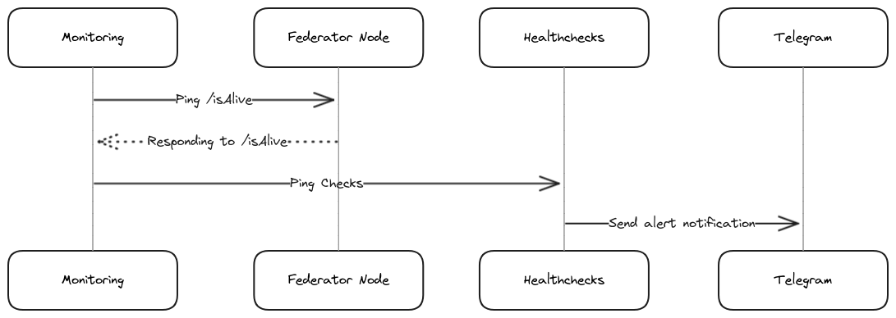

# Basic Federator Node Availability Monitoring and Alert System <!-- [short title of solved problem and solution] -->

* Status: accepted  <!--[draft | proposed | rejected | accepted | deprecated | … | superseded by [ADR-0005](0005-example.md)] -->
* Date: 2024-06-28 <!-- [YYYY-MM-DD when the decision was last updated] -->

Technical Story: Implementing a basic system for monitoring the availability of the Federator node and setting up alerts to notify in case of downtime.  <!-- [description | ticket/issue URL] -->

## Context and Problem Statement

<!-- [Describe the context and problem statement, e.g., in free form using two to three sentences. You may want to articulate the problem in form of a question.] -->

Currently, there is no monitoring system in place to check the federator node's availability, and issues are only identified reactively. This lack of proactive monitoring results in delayed responses to downtime, impacting the quality and reliability of the service provided. How can be implemented a cost-effective and efficient system to monitor node availability and alert stakeholders promptly when issues arise?

### Technical Details

The Federator node is implemented using `Node.js` and relies on `RPC` for blockchain communication. Core logic is implemented in Typescript, enabling communication with the blockchain through JSON-RPC. The application is containerized using Docker and use docker-compose to integrate the application with a database, providing an isolated environment for deployment. Additionally, it includes endpoints for various functionalities, such as checking the status of the node as details below. 

* **<DOMAIN:PORT>/isAlive**
* **Method:**
  `GET`
* **Success Response:**
  * **Code:** 200  
    **Content:** `{ "status" : "ok" }`

This status endpoint will be used to implement the health check system. The monitoring tool will periodically query this endpoint to ensure the node is available. 

## Decision Drivers 
<!-- [driver 1, e.g., a force, facing concern, …] -->
* The requirement to implement a `cost-effective` monitoring solution due to the project's non-priority status and the limited budget available.
* Prioritizing cost over the highest quality of monitoring is essential.
* The current lack of technical expertise with AWS necessitating a straightforward and easy-to-manage solution.

## Considered Options

* [AWS CloudWatch](https://aws.amazon.com/cloudwatch/) 
* [Prometheus](https://prometheus.io/)
* [Healthchecks](https://healthchecks.io/)

## Decision Outcome

<!-- Chosen option: "[option 1]", because [justification. e.g., only option, which meets k.o. criterion decision driver | which resolves force force | … | comes out best (see below)].

### Positive Consequences 

* [e.g., improvement of quality attribute satisfaction, follow-up decisions required, …]
* …

### Negative Consequences 

* [e.g., compromising quality attribute, follow-up decisions required, …]
* … -->

## Decision Outcome

Chosen option: [Healthchecks](https://healthchecks.io/), because it is the most cost-effective solution, aligns with our limited budget, and is easy to set up and maintain. It meets our decision drivers by prioritizing cost over the highest quality of monitoring and does not require advanced technical expertise.

The ongoing costs for cloud/third-party  services are minimal. Healthchecks.io offers a hobbyist plan at $0 per month, which fits our needs. AWS CloudWatch, although affordable, may require custom metrics, potentially costing less than $4 per month. Prometheus incurs no direct costs if deployed on the current EC2 instance. The major expense is development: Healthchecks.io is the most cost-effective due to minimal human resource requirements and existing expertise. AWS follows, with higher costs due to inexperience, and Prometheus requires the highest development effort due to its open-source nature and need for adaptation.

### Positive Consequences

* Significant cost savings compared to other options, making it suitable for our non-priority project status and limited budget.
* Easy and quick setup with minimal configuration required, allowing us to implement monitoring without deep technical knowledge.
* Reduced maintenance overhead since it is a managed service, freeing up resources for other tasks.
* Reliable alerts and monitoring with free and affordable pricing plans, ensuring timely notifications of any issues.

### Negative Consequences

* Limited flexibility and fewer advanced features compared to AWS CloudWatch and Prometheus, which may restrict future scalability.
* Dependence on a third-party service for monitoring, which could introduce reliability risks if the service experiences downtime.
* Less control over advanced configuration and data handling, potentially limiting customization and integration with other systems.

### Proposed Design
<!-- without getting into implementation where possible -->

A Docker container hosts a monitoring script that periodically checks the federator node's /isAlive endpoint to ensure availability. This script pings to Healthchecks Check Point. Healthchecks, in turn, triggers notifications via Telegram if it detects that the federator node is unavailable.

Outline:

* _Infrastructure as Code (IaC)_: Use [Healthchecks API](https://healthchecks.io/docs/api/) to programmatically set up and manage the health check, specifying the check interval, and configuring alert rules.

* _Docker Containerization_: The health check script and its corresponding cron job will be containerized using Docker.

* _Docker Compose Integration_: Integrate monitoring container with the existing docker-compose.yml file, ensuring it runs alongside the federator node service. 

* _Telegram Integration_: Alerts for health check failures will be configured to be sent via [Healthchecks.io Telegram Integration](https://healthchecks.io/integrations/telegram/).

## Pros and Cons of the Options

<!-- ### [option 1]

[example | description | pointer to more information | …]

* Good, because [argument a]
* Good, because [argument b]
* Bad, because [argument c]
-->

### AWS CloudWatch

[AWS CloudWatch](https://aws.amazon.com/cloudwatch/) is a monitoring and management service from AWS that provides insights to monitor applications and respond to performance changes. It is a pay-as-you-go service. Configuration requires setting up CloudWatch to monitor the `/isAlive` endpoint, creating Lambda functions for health checks, and configuring SNS for alerts.

* Good, because it provides seamless integration with other AWS services.
* Good, because it offers robust alerting and monitoring capabilities.
* Bad, because it can be costly depending on usage.
* Bad, because it requires familiarity with AWS, which our team currently lacks.
* Bad, because the initial setup can be complex due to the involvement of multiple AWS services (CloudWatch, Lambda, SNS).

### Prometheus

[Prometheus](https://prometheus.io/) is an open-source monitoring and alerting toolkit designed for reliability and scalability. It collects and stores metrics as time series data, providing a powerful query language to analyze that data. Setting up Prometheus involves installing the server, configuring a Node.js exporter for the `/isAlive` endpoint, and setting up Alertmanager for notifications.

* Good, because it is open source and free to use.
* Good, because it is highly flexible and extensible.
* Good, because it has a strong community and extensive documentation.
* Bad, because it requires continuous maintenance and management of infrastructure.
* Bad, because it has a steep learning curve for those unfamiliar with monitoring tools.
* Bad, because it may require additional resources for setup and ongoing administration.

### Healthchecks

[Healthchecks](https://healthchecks.io/) is a service for monitoring the availability of HTTP endpoints. It works by sending periodic HTTP requests to a specified URL and alerts you if the endpoint does not respond within a set time frame. The setup involves configuring a check for the `/isAlive` endpoint, and setting up a cron job to call the Healthchecks ping URL from a script.

* Good, because it is very easy to set up and use.
* Good, because it offers a cost-effective solution with free and reasonably priced plans.
* Good, because it does not require own infrastructure or extensive technical expertise.
* Bad, because it is less flexible and has fewer features compared to AWS CloudWatch and Prometheus.
* Bad, because it depends on a third-party service for monitoring.
* Bad, because it offers less control over advanced configuration and data handling.

## Links <!-- optional -->

* Template from [the-madr-project](https://github.com/joelparkerhenderson/architecture-decision-record/blob/main/locales/en/templates/decision-record-template-of-the-madr-project/index.md)